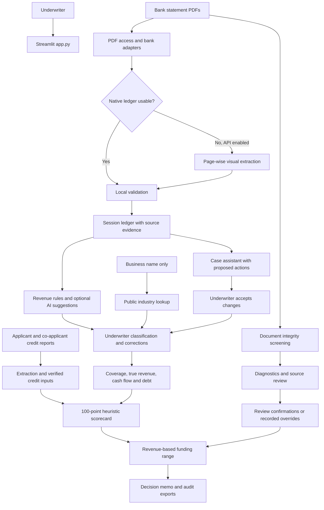
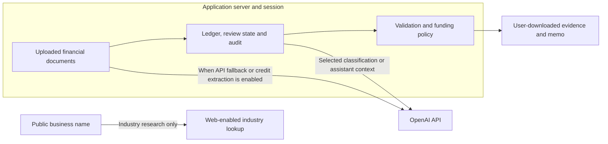

# Forward Funding Tool architecture

## Current design

The tool is a Python Streamlit application. A single server process renders the interface and coordinates local PDF parsing, optional OpenAI requests, financial validation and underwriter review. Case data and caches live primarily in Streamlit session state. The current application requires no SQL database, REST service or React frontend.

## Components and responsibilities

| Component | Implementation | Responsibility |
|---|---|---|
| Application shell | `app.py` | Four tabs, session orchestration, scorecard, review gates and exports |
| PDF access | `pdf_access.py` | Open original bytes; recover unreadable page trees in memory |
| Native extraction | Bank-specific `*_parser.py` modules and native routines in `app.py` | Read known layouts and retain transaction evidence |
| AI extraction | `ai_extraction.py`, `extraction_foundation.py` | Responses structured output, two concurrent page requests, bounded retries and session checkpoints |
| Validation | `statement_validation.py`, `source_date_checks.py` | Monetary arithmetic, dates, totals, source checkpoints and reconciliation |
| Document screening | `statement_integrity.py`, `statement_identification.py` | Explainable layout/editing signals and document identification |
| Identity and industry | `business_identity.py`, `industry_lookup.py`, `industry_catalog.py` | Legal/trade names, public research and descriptive activity choices |
| Case settings | `statement_settings.py` | CAD default policy, foreign-currency confirmation and verified coverage dates |
| Revenue review | `revenue_tools.py` | Rule-based exclusions, AI suggestions, payer rules and explicit underwriter decisions |
| Debt and risk | `debt_review.py`, `payment_risk.py`, `mca_funding.py` | Verified obligations, returned payments and observed MCA funding/repayment evidence |
| Calculations | `cashflow.py`, `currency_reporting.py`, `funding_engine.py` | Calendar coverage, currency reporting and funding arithmetic |
| Credit inputs | `credit_inputs.py` and credit routines in `app.py` | Separate applicant/co-applicant results and manual score entry |
| Source corrections | `balance_review.py` | Explicit balance correction, original-value retention and revalidation |
| Assistant | `case_assistant.py` | Case conversation and validated, explicitly accepted changes |

## Data flow and evidence

1. Uploaded bytes receive a content hash. Native extraction is attempted before optional AI fallback. Unsupported or inconsistent files remain visible rather than silently disappearing.
2. Each statement result carries account identity, currency, coverage, source file/hash, transactions, issues and validation metadata. Transaction evidence includes source page and, where available, position/sequence information.
3. The assembled ledger preserves credits and debits separately. Duplicate and internal-transfer handling occur before consolidated calculations. Non-revenue funding and transfers must not inflate sales.
4. Review decisions, verified debt positions and source corrections are recorded in session audit structures. Correcting an input invalidates the previous underwriting result; diagnostic overrides retain the underlying evidence.
5. Funding calculations use reviewed true revenue and explicit underwriting inputs. Users export decision memos and audit records before ending a session.

## Business-policy boundaries

- The scorecard totals 100 possible points, including seven cash-flow points. It is not a trained or validated probability-of-default model.
- Grade thresholds and revenue percentages are explicit policy in the code. The principal estimate is based on true average monthly revenue; cash flow does not directly cap principal under the current policy.
- First position allows 5–8 months, second up to six, third up to five, and later positions generally 3–4. See `funding_engine.py` for exact bounds.
- The lower range is 85% of the upper; the displayed median is their midpoint, not a statistical forecast percentile.
- Missing coverage requires source confirmation. Partial periods are labeled and may be extrapolated; unobserved activity is not silently treated as zero.
- Unspecified currency defaults to CAD under the configured case policy. This is an assumption, distinct from printed currency or underwriter confirmation. Explicit USD is preserved and requires an exchange rate for CAD reporting.
- MCA completion uses observed advance × 1.46 versus observed repayments. Missing advances, ambiguous contracts or returned payments prevent automatic completion claims. Debt positions are not automatically discharged.
- Returned-item credits without a stated reason are distinguished from confirmed NSF wording. Related generic service charges are not relabeled as confirmed NSF fees.

## External services and trust boundaries

Documents, extracted descriptions and webpages are untrusted data, never authorization to change policy or execute actions. Financial source documents are not sent by industry lookup. API keys belong in local secrets or the deployment secret store, never in Git. The application requests `store=False` for its Responses-based extraction/research paths; that flag is not a substitute for reviewing provider data-handling terms.

The repository excludes raw customer PDFs, exported ledgers, private case reports, credentials and runtime caches. Synthetic tests and code may reference fixture filenames; private fixtures are not shipped.

## Performance and failure handling

Native parsing, integrity checks and source-date checks can be expensive on long, outlined or scanned PDFs. AI extraction currently submits up to two concurrent page requests, with first/previous-page context. Successful pages are cached in the session. Localized defects invalidate relevant page entries first; broader discrepancies can require wider re-extraction. Authentication/quota errors pause additional AI requests for that batch.

Stage messages distinguish local checks from API extraction. These are progress indicators, not latency guarantees. Future optimization should profile repeated PDF reads and reduce duplicated page analysis while retaining independent arithmetic/source checks.

## Persistence and deployment limits

There is no durable multi-user case store, production authentication/authorization layer, independent REST API or trained ML model in this implementation. Audit exports provide evidence snapshots; they are not an immutable centralized audit service. Restarting or clearing a case can remove session data.

`production/schema.sql` is an inactive legacy design draft. It is not required, applied, or integrated with the application. The workplace's file-only workflow remains the supported design.

Before a shared deployment, decide access control, retention, encrypted storage, user isolation, backup and concurrency requirements. A future REST API or React client should call the same tested calculation and validation modules, rather than duplicating financial policy. Any future PD model needs a defined outcome dataset, validation, calibration and model-version audit; it must not be presented as implemented today.

## Verification

Pure functions are covered by unit tests, with Streamlit AppTest checking review controls and state transitions. External API behavior is generally mocked in regression tests. Private bank-fixture tests are opt-in. A passing test suite does not certify arbitrary uploaded statements or authenticate bank documents.

See [README](README.md) for setup and [deployment notes](README_DEPLOYMENT.md) for operating the current file-based application.
